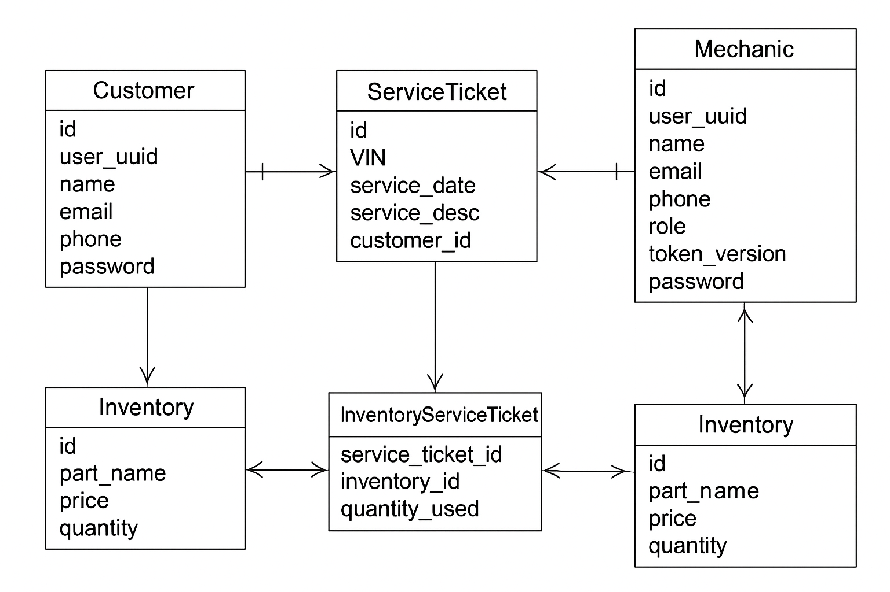

# E-Commerce API with Flask

A RESTful API for managing users, orders, and products built with Flask, SQLAlchemy, and MySQL.

---

## Table of Contents

1. [Features](#features)  
2. [Tech Stack](#tech-stack)  
3. [Installation](#installation)  
4. [Entity-Relationship Diagram](#entity-relationship-diagram)  
5. [Database Models](#database-models)  
6. [API Endpoints](#api-endpoints)  
7. [Example Requests & Responses](#example-requests--responses)  

9. [Running the App](#running-the-app)  
10. [Contributing](#contributing)  
11. [License](#license)  

---

## Features

- CRUD operations for customers, mechanics, and service_tickets.  
- One-to-many relationships (Customer → ServiceTicket).  
- Many-to-many relationships with extra data (ServiceTicket ↔ Mechanic via ServiceTicketMechanic).  
- Marshmallow schemas for serialization and validation.  
---

## Tech Stack

- **Backend:** Python, Flask  
- **Database:** MySQL  
- **ORM:** SQLAlchemy  
- **Serialization:** Flask-Marshmallow, Marshmallow-SQLAlchemy  

---

## Installation

```bash
git clone https://github.com/putman44/Assignment-Building-API-with-Application-Factory-Pattern
cd Assignment-Building-API-with-Application-Factory-Pattern

python3 -m venv venv
source venv/bin/activate  # Mac/Linux
venv\Scripts\activate     # Windows

pip install Flask Flask-SQLAlchemy Flask-Marshmallow mysql-connector-python marshmallow-sqlalchemy

## Entity-Relationship Diagram


## API Endpoints

### Customers
POST   /customers                    - Create a customer
GET    /customers                    - List all customers
GET    /customers/<id>               - Get a customer
PUT    /customers/<id>               - Update a customer
DELETE /customers/<id>               - Delete a customer

### Mechanics
POST   /mechanics                 - Create a mechanic
GET    /mechanics                 - List all mechanics
GET    /mechanics/<id>            - Get a mechanic
PUT    /mechanics/<id>            - Update a mechanic
DELETE /mechanics/<id>            - Delete a mechanic

### Service Tickets
POST   /service_tickets                          - Create a service ticket
GET    /service_tickets                          - List all service tickets
GET    /service_tickets/<id>                     - Get a service ticket
PUT    /service_tickets/<id>                     - Update a service ticket
DELETE /service_tickets/<id>                     - Delete a service ticket
